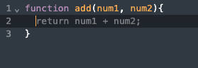

# codemirror-copilot

This CodeMirror extension lets you use GPT to autocomplete code in CodeMirror. It let's you call your API with current code (prefix and suffix from current cursor position) and let your API return the code to autocomplete.



## Installation

```bash
npm install codemirror-copilot --save
```

## Usage

```javascript
import CodeMirror from '@uiw/react-codemirror';
import { javascript } from '@codemirror/lang-javascript';
import { inlineCopilot } from 'codemirror-copilot';

function CodeEditor() {
  return (
    <CodeMirror
      value=""
      height="300px"
      extensions={[
        javascript({ jsx: true }),
        
        // Implement a function that returns a promise that resolves to the prediction
        inlineCopilot(async (prefix, suffix) => {
          const res = await fetch('/api/autocomplete', {
            method: 'POST',
            headers: {
              'Content-Type': 'application/json',
            },
            body: JSON.stringify({ prefix, suffix, language: "javascript" }),
          });
        
          const { prediction } = await res.json();
          return prediction;
        })
      ]}
    />
  );
}
```

You also need to implement an API that returns the prediction. For above code, here is an example API in Next.js that uses OpenAI 's `gpt-3.5-turbo-1106` model:

```javascript
import OpenAI from "openai";

const openai = new OpenAI({
  apiKey: process.env.OPENAI_API_KEY,
});

async function completion(prefix, suffix, model="gpt-3.5-turbo-1106", language){
  const chatCompletion = await openai.chat.completions.create({
    messages: [
      {
        role: "system",
        content: `You are a ${language?(language + " "):""}programmer that replaces <FILL_ME> part with the right code. Only output the code that replaces <FILL_ME> part. Do not add any explanation or markdown.`,
      },
      { role: "user", content: `${prefix}<FILL_ME>${suffix}` },
    ],
    model,
  });

  return chatCompletion.choices[0].message.content;
}

export default async function handler(req, res) {
  const { prefix, suffix, model, language } = req.body;
  const prediction = await completion(prefix, suffix, model, language);
  console.log(prediction)
  res.status(200).json({ prediction })
}

```


## License

MIT © [Asad Memon](https://asadmemon.com)